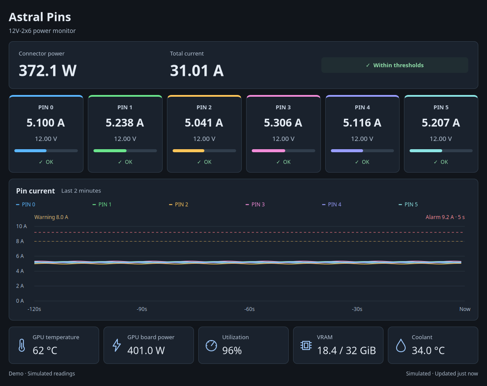

# astral-pins

Per-pin 12V-2x6 power monitoring for ASUS ROG Astral RTX 50-series cards on
Linux — a GTK4 panel that reads the card's onboard ITE **IT8915FN** monitoring
chip directly over I2C.

ASUS markets this hardware as *Power Detector+* and surfaces it in GPU Tweak
on Windows. This tool talks to the same chip from Linux, read-only, with no
driver and no vendor software.



## What it shows

- Six color-coded pin cards with volts, amps, gauges, and explicit status labels
- A 2-minute rolling graph with a six-pin legend, warning/alarm guides, and timestamps
- Hover over the plot for a horizontal dotted current guide and each pin's highest
  visible reading at or above that level. Matching peaks are marked on the graph;
  the summary identifies pins below the line or without history.
- Total connector watts and amps
- GPU temperature, board power, utilization, and VRAM via `nvidia-smi`
- AIO coolant temperature via a `rog_ryujin` hwmon, when one is present
- A red alert banner if any pin sustains more than 9.2 A (ASUS's own warning
  threshold) for 5+ seconds, or if a pin reads ~0 A while the connector is
  under load — the classic melted-connector dropout signature

The slate-and-blue interface adapts to narrower windows by wrapping pin cards
and telemetry tiles, with vertical scrolling when needed. Sensor read failures
replace live readings with dashes and label the remaining plot as historical.
GPU telemetry remains independent of connector connectivity.

## How it works (the interesting part)

The IT8915FN sits at address `0x2b` on one of the NVIDIA I2C buses the GPU
driver exposes. Per-pin data lives at registers `0x80`–`0x97`: six pins ×
(2 bytes millivolts + 2 bytes milliamps), big-endian, in reverse pin order.

One empirical quirk worth knowing if you're doing something similar: the chip
does **not** answer raw `I2C_RDWR` transfers through NVIDIA's adapter — block
reads and byte-wise raw reads both return junk. It only responds to the
kernel's **SMBus read-byte-data ioctl** path (what `i2cget -y BUS 0x2b REG b`
does). So that is exactly what this tool does, 24 register reads per poll,
via `ioctl(fd, I2C_SMBUS, ...)` with no external dependencies.

## Install on Linux

From this repository's directory, run as your normal user:

```sh
sh setup.sh
```

Setup detects your distro, installs Python/GTK4/Cairo and device-access tools,
configures I2C permissions and systemd module loading, and adds the app to your
menu. It prompts for sudo when needed. **Log out and back in**, then open
**Astral Pins** or run `~/.local/bin/astral-pins`.

| Distro family | Includes |
| --- | --- |
| Debian / Ubuntu | Mint, Pop!_OS, elementary OS |
| Fedora / RHEL | Rocky, AlmaLinux, CentOS Stream with required repos enabled |
| Arch | EndeavourOS, Manjaro |
| openSUSE | Tumbleweed, compatible Leap releases |

Requires a desktop, Python 3.10+ availability, an **Astral RTX 50-series GPU**,
and a working NVIDIA proprietary driver. Setup checks the driver; install it
through your distro's tools if missing. Arch setup includes a full system
upgrade. Other distros and immutable systems need their native dependency and
host configuration tools; use `python3 install.py` after configuring them.

- **Preview without hardware:** `sh setup.sh --demo`
- **Inspect the plan:** `sh setup.sh --dry-run`
- **Check installed bindings:** `python3 install.py --check`

**Keep this checkout:** the launcher uses it directly. Pull updates and restart
the app; rerun setup to refresh dependencies or after moving the checkout.
The launcher and taskbar use the app’s A-and-six-pins logo. The desktop ID
matches its GTK application ID.

Libraries are managed by your distro's normal updater. Weekly CI installs current
packages on all five test distros and opens a maintenance issue if compatibility
breaks; Dependabot checks CI actions weekly. These schedules start after merge.

Package names, including Fedora's full GObject/Cairo bindings, live in
[scripts/linux-deps.sh](scripts/linux-deps.sh). Non-systemd hosts need their own
boot-time `i2c-dev` configuration. No automatic NVIDIA driver replacement is performed.

To uninstall the default launchers:

```sh
rm ~/.local/bin/astral-pins
rm "${XDG_DATA_HOME:-$HOME/.local/share}/applications/dev.zac.astralpins.desktop"
rm "${XDG_DATA_HOME:-$HOME/.local/share}/icons/hicolor/scalable/apps/dev.zac.astralpins.svg"
```

## Development checks

The Linux installation workflow checks Ubuntu 22.04, Debian stable, Fedora,
Arch Linux, and openSUSE Tumbleweed. It also runs the GTK tests and builds a
Python wheel on Ubuntu. These checks do not exercise physical GPU hardware.

With GTK4 and a display available:

```
python3 -m unittest discover -s tests -v
python3 -m py_compile astral_pins.py
```

The integration checks use simulated samples for threshold boundaries, alarm
duration, dropout detection, stale-data recovery, history, and missing telemetry.
They skip when no GTK display is available. A headless GTK Broadway display can
be used instead:

```
gtk4-broadwayd -a 127.0.0.1 -p 8097 :7
# In another terminal:
GDK_BACKEND=broadway BROADWAY_DISPLAY=:7 python3 -m unittest discover -s tests -v
```

## Safety

All chip access is read-only — the tool never writes a register. The alarm
thresholds mirror what ASUS uses (9.2 A per pin warning); they're constants
at the top of the script if you want different ones.

## Disclaimer

Not affiliated with or endorsed by ASUS, ITE, or NVIDIA. Register layout was
determined empirically on one card; other Astral models may differ. Use at
your own risk.

## License

[MIT](LICENSE)
